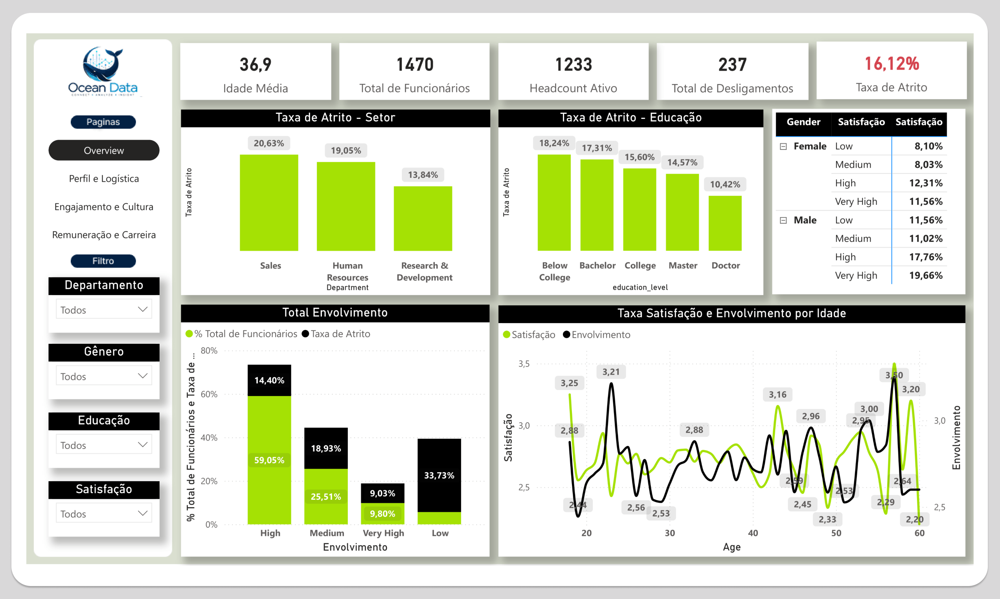
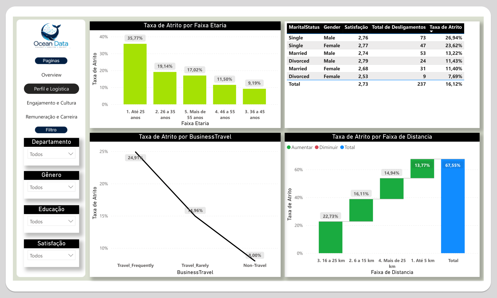
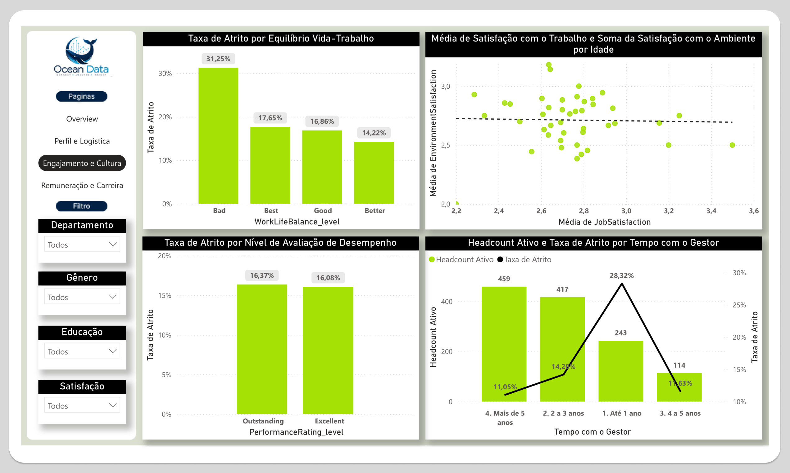
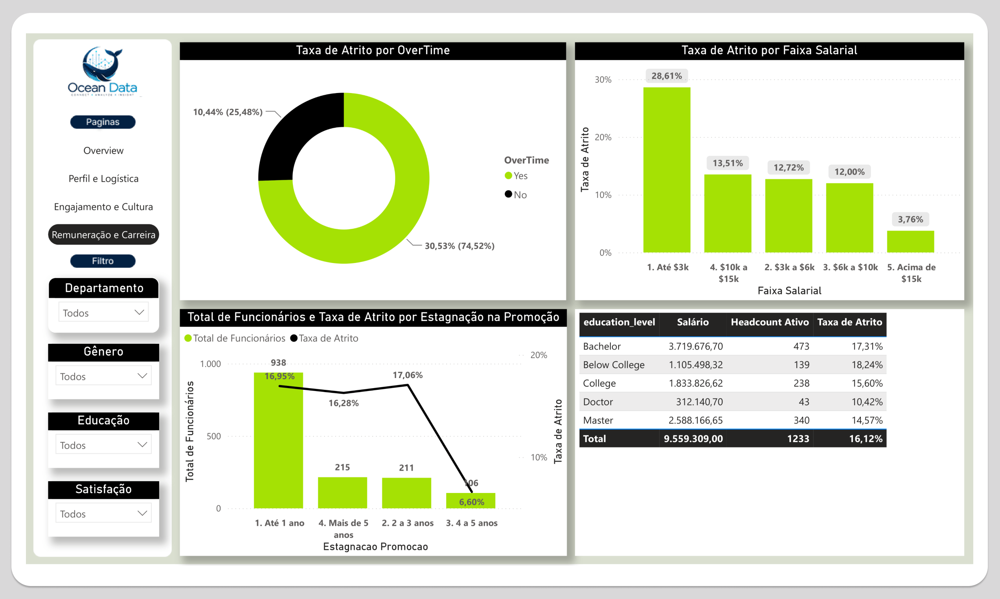
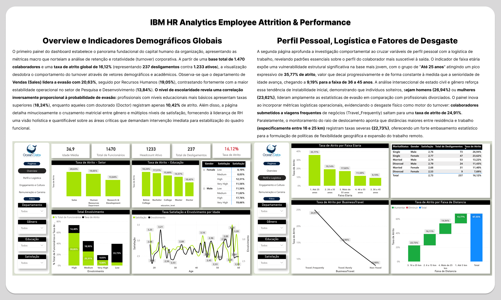
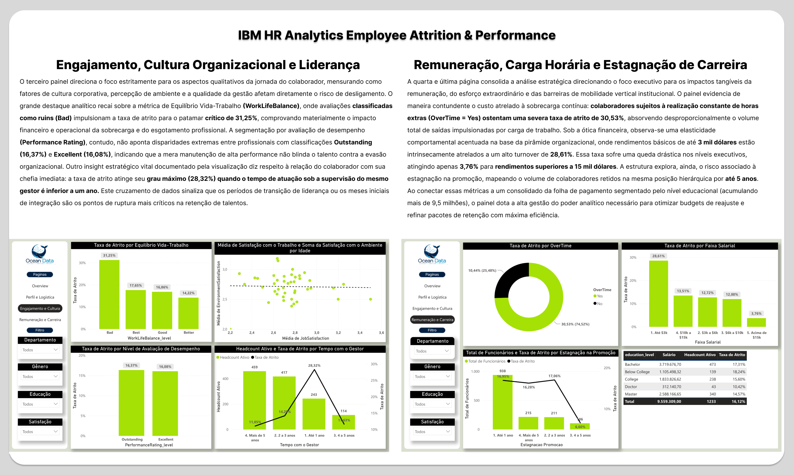

# 🛒 Brazilian E-Commerce | Análise de Vendas & Logística

> Análise de e-commerce desenvolvida no Power BI sobre o dataset público da **Olist**, cobrindo vendas, logística, pagamentos, avaliações e distribuição geográfica entre 2016 e 2018. O projeto transforma dados brutos de pedidos em indicadores estratégicos que permitem entender o comportamento de compra, a performance de entrega e a satisfação dos clientes no maior marketplace brasileiro.

---

## 📊 Acesse o Dashboard Interativo

Para navegar pelas páginas, utilizar os filtros e explorar os indicadores dinamicamente, acesse a versão publicada no Power BI Web:

---

## 🖼️ Visão Geral do Projeto

### Dashboard

| | |
|:---:|:---:|
|  |  |
|  |  |

### Explicação do Projeto

| | |
|:---:|:---:|
|  |  |

---

## 💡 Principais Insights Analíticos

A análise dos **99.441 pedidos** realizados entre 2016 e 2018 revelou padrões importantes sobre vendas, logística e satisfação no e-commerce brasileiro:

🟢 **Taxa de entrega de 97%:** Dos 99.441 pedidos analisados, **96.478 foram entregues com sucesso**, demonstrando alta confiabilidade operacional da plataforma. Apenas **625 pedidos foram cancelados** (0,63% do total).

⏱️ **Tempo médio de entrega de 11,2 dias:** A média de dias entre a aprovação do pedido e o recebimento pelo cliente foi de **11,2 dias**, com um desvio médio de **12,6 dias** em relação à data estimada, indicando que as estimativas tendem a ser conservadoras.

💳 **Cartão de crédito domina os pagamentos:** O cartão de crédito representa **74,1% das transações** (76.795 pedidos) e **78,3% do valor total transacionado**, enquanto o boleto bancário aparece em segundo lugar com 19,1% das transações.

🗺️ **São Paulo concentra 42% dos pedidos:** O estado de SP lidera com **41.746 pedidos**, seguido por RJ com 12.852 e MG com 11.635. A região Sudeste domina o volume de compras no período analisado.

🛏️ **Cama, Mesa e Banho é a categoria mais vendida:** Com **11.115 itens vendidos**, lidera o ranking de categorias, seguida por Beleza & Saúde (9.670) e Esporte & Lazer (8.641).

⭐ **Nota média de avaliação de 4,09/5:** Baseado em **99.224 avaliações** de clientes, a plataforma mantém um nível elevado de satisfação, próximo à meta de score 5.

💰 **Receita total de R$ 1,6 bilhão:** O volume financeiro transacionado no período foi de **R$ 1.600.887.212**, com ticket médio de **R$ 16.098 por pedido** e custo total de frete de **R$ 225.190.954**.

📦 **3.095 vendedores ativos:** A plataforma contou com um marketplace diversificado de vendedores distribuídos por todo o Brasil, oferecendo mais de **32.951 produtos** cadastrados.

---

## 📈 Resumo de KPIs

| Métrica | Valor | Métrica | Valor |
|---|---:|---|---:|
| 📦 **Total de Pedidos** | 99.441 | ✅ **Pedidos Entregues** | 96.478 |
| 🛍️ **Total de Clientes** | 99.441 | ❌ **Pedidos Cancelados** | 625 |
| 🏪 **Total de Vendedores** | 3.095 | ⭐ **Nota Média** | 4,09 / 5 |
| 📦 **Total de Produtos** | 32.951 | 💰 **Receita Total** | R$ 1,6 bi |
| ⏱️ **Tempo Médio de Entrega** | 11,2 dias | 🚚 **Custo Total de Frete** | R$ 225 mi |

---

## ⚙️ Arquitetura do Modelo Semântico

O projeto utiliza um modelo relacional em **esquema estrela**, com a tabela `olist_orders_dataset` como fato central conectando todas as dimensões. Uma tabela dedicada concentra todas as medidas DAX.

```mermaid
graph TD
    A[Olist Brazilian E-Commerce Dataset] --> B[olist_orders_dataset]
    A --> C[olist_order_items_dataset]
    A --> D[olist_order_payments_dataset]
    A --> E[olist_order_reviews_dataset]
    A --> F[olist_customers_dataset]
    A --> G[olist_products_dataset]
    A --> H[olist_sellers_dataset]
    A --> I[olist_geolocation_dataset]
    A --> J[product_category_name_translation]

    B --> K[order_id / order_status]
    B --> L[Datas: compra, aprovação, entrega]
    B --> M[Colunas Calculadas DAX]

    N[Measure Table] --> O[avg_diff_reciving]
    N --> P[avf_date_finish]
    N --> Q[meam_avg]
    N --> R[target_score]
    N --> S[Média diff_recive_date YTD]
    N --> T[Média diff_recive_date MTD]
    N --> U[Média order_delevery_date_finish MTD]
    N --> V[Média review_score MTD]
```

---

## 🗂️ Dicionário de Dados

### olist_orders_dataset — Tabela Fato Central

| Coluna | Tipo | Descrição |
|---|---|---|
| `order_id` | String | Identificador único do pedido |
| `customer_id` | String | Chave para a tabela de clientes |
| `order_status` | String | Status do pedido (delivered, shipped, canceled...) |
| `order_purchase_timestamp` | DateTime | Data e hora da compra |
| `order_approved_at` | DateTime | Data de aprovação do pagamento |
| `order_delivered_carrier_date` | DateTime | Data de entrega à transportadora |
| `order_delivered_customer_date` | DateTime | Data de entrega ao cliente |
| `order_estimated_delivery_date` | DateTime | Data estimada de entrega |
| `diff_recive_date` ⚙️ | Decimal | Dias entre aprovação e entrega ao cliente |
| `order_delevery_date_finish` ⚙️ | Decimal | Desvio em dias entre estimativa e entrega real |

> ⚙️ *Colunas calculadas adicionadas no Power Query / DAX*

### olist_order_items_dataset — Itens do Pedido

| Coluna | Tipo | Descrição |
|---|---|---|
| `order_id` | String | Chave para a tabela de pedidos |
| `order_item_id` | Int | Sequência do item dentro do pedido |
| `product_id` | String | Chave para a tabela de produtos |
| `seller_id` | String | Chave para a tabela de vendedores |
| `shipping_limit_date` | DateTime | Data limite para envio pelo vendedor |
| `price` | Decimal | Preço do item |
| `freight_value` | Decimal | Valor do frete do item |
| `Ano` ⚙️ | String | Ano extraído da data de envio |
| `Mês` ⚙️ | String | Número do mês |
| `Nome do Mês` ⚙️ | String | Nome do mês por extenso |
| `Semana` ⚙️ | String | Semana do ano |

### Demais Tabelas

| Tabela | Principais Colunas |
|---|---|
| `olist_customers_dataset` | `customer_id`, `customer_city`, `customer_state`, `customer_zip_code_prefix` |
| `olist_order_payments_dataset` | `order_id`, `payment_type`, `payment_installments`, `payment_value` |
| `olist_order_reviews_dataset` | `order_id`, `review_score`, `review_comment_message`, `review_creation_date` |
| `olist_products_dataset` | `product_id`, `product_category_name`, `product_weight_g`, dimensões físicas |
| `olist_sellers_dataset` | `seller_id`, `seller_city`, `seller_state` |
| `olist_geolocation_dataset` | `geolocation_zip_code_prefix`, `Latitude_Corrigida`, `Corrigido` (lng) |
| `product_category_name_translation` | `product_category_name`, `product_category_name_english` |

---

## 📐 Medidas DAX

Todas as medidas estão centralizadas na tabela `Measure`.

| Medida | Expressão DAX | Descrição |
|---|---|---|
| `avg_diff_reciving` | `AVERAGE(olist_orders_dataset[diff_recive_date])` | Tempo médio geral de entrega em dias (aprovação → recebimento) |
| `avf_date_finish` | `AVERAGE(olist_orders_dataset[order_delevery_date_finish])` | Desvio médio entre prazo estimado e entrega real |
| `meam_avg` | `([avf_date_finish] + [avg_diff_reciving]) / 2` | Média combinada dos dois indicadores de prazo logístico |
| `target_score` | `5` | Meta de avaliação dos clientes (nota máxima) |
| `Média de diff_recive_date YTD` | `TOTALYTD(AVERAGE(...), order_approved_at.[Date])` | Tempo médio de entrega acumulado no ano |
| `Média de diff_recive_date MTD` | `TOTALMTD(AVERAGE(...), order_approved_at.[Date])` | Tempo médio de entrega acumulado no mês |
| `Média de order_delevery_date_finish MTD` | `TOTALMTD(AVERAGE(...), order_approved_at.[Date])` | Desvio médio de prazo acumulado no mês |
| `Média de review_score MTD` | `TOTALMTD(AVERAGE(...), review_answer_timestamp.[Date])` | Nota média de avaliação acumulada no mês |

---

## 🛠️ Ferramentas e Tecnologias

| Ferramenta | Uso |
|---|---|
| **Power BI Desktop** | Modelagem de dados, criação de medidas DAX e desenvolvimento dos visuais |
| **Power Query (M)** | Tratamento, limpeza e transformação dos dados brutos CSV |
| **DAX** | Cálculo de métricas, inteligência de tempo (YTD, MTD) e KPIs logísticos |
| **Kaggle** | Fonte do dataset público da Olist |

---

## 📦 Sobre o Dataset

O **Brazilian E-Commerce Public Dataset by Olist** contém informações reais de pedidos realizados em diversas categorias de produtos no Brasil, anonimizadas e disponibilizadas publicamente no Kaggle.

| Informação | Detalhe |
|---|---|
| 📅 Período | Setembro 2016 – Outubro 2018 |
| 📦 Pedidos | ~100.000 |
| 👥 Clientes únicos | ~96.000 |
| 🏪 Vendedores | ~3.000 |
| 🛍️ Produtos cadastrados | ~33.000 SKUs |
| 🗂️ Categorias | 73 categorias de produtos |
| 🗺️ Cobertura | 27 estados do Brasil |
| 🔗 Fonte | [Kaggle — Olist Brazilian E-Commerce](https://www.kaggle.com/datasets/olistbr/brazilian-ecommerce) |

---

## 👤 Autor

Feito por **Italo Silva**

---

## 📄 Licença

Dataset original licenciado sob [CC BY-NC-SA 4.0](https://creativecommons.org/licenses/by-nc-sa/4.0/) pela Olist.
Este projeto (análise e dashboard) é de uso livre para fins educacionais e de portfólio.
