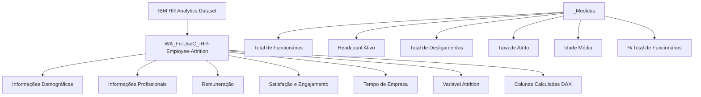

# 👥 IBM HR Analytics | Employee Attrition & Performance

> Análise de People Analytics desenvolvida no Power BI para identificar padrões relacionados ao desligamento de colaboradores. O projeto transforma dados de RH em indicadores estratégicos, permitindo analisar fatores como remuneração, idade, horas extras, satisfação, viagens e equilíbrio entre vida pessoal e profissional.

---

## 📊 Acesse o Dashboard Interativo

Para navegar pelas páginas, utilizar os filtros e explorar os indicadores dinamicamente, acesse a versão publicada no Power BI Web:

---

## 🖼️ Visão Geral do Projeto

### Dashboard

| | |
|:---:|:---:|
|  |
|  |
|  | 
|  |

### Explicação do Projeto

| | |
|:---:|:---:|
|  |  |

---

## 💡 Principais Insights Analíticos

A análise dos **1.470 colaboradores** revelou padrões importantes relacionados ao risco de desligamento:

🔴 **Taxa geral de atrito de 16,12%:** Dos 1.470 colaboradores analisados, **237 deixaram a organização**. O indicador representa o principal KPI do projeto e serve como referência para identificar os grupos com maior risco de saída.

⏱️ **Horas extras apresentam forte associação com o desligamento:** Enquanto **28,3% da força de trabalho realizava horas extras**, entre os colaboradores desligados esse percentual chegou a **53,6%**, indicando uma forte concentração de desligamentos nesse grupo.

👨‍💼 **Sales Representative apresenta o maior índice de atrito:** O cargo registrou uma taxa de **39,8%**, com 33 desligamentos em um total de 83 colaboradores. Além disso, apresentou o menor salário médio entre os cargos analisados.

👶 **Colaboradores com até 25 anos concentram maior risco:** A taxa de atrito desse grupo foi de **35,8%**, mais que o dobro da média geral da organização.

💰 **Baixa remuneração está associada a maiores taxas de desligamento:** Colaboradores com salário de até **$3.000 mensais** apresentaram uma taxa de atrito de **28,6%**, enquanto aqueles com salários acima de $15.000 tiveram apenas **3,8%**. O salário médio dos desligados foi de **$4.787**, contra **$6.503** da média geral.

✈️ **Viagens frequentes aumentam significativamente o atrito:** O grupo `Travel_Frequently` apresentou **24,9% de desligamentos**, enquanto os colaboradores classificados como `Non-Travel` tiveram apenas **8,0%**.

⚖️ **Equilíbrio entre vida pessoal e trabalho influencia o risco:** Colaboradores que classificaram seu `WorkLifeBalance` como **Bad** apresentaram uma taxa de atrito de **31,3%**, uma das maiores observadas na análise.

📈 **Cargos de entrada concentram grande parte dos desligamentos:** O `JobLevel 1` representa aproximadamente **37% da força de trabalho**, mas concentra **143 dos 237 desligamentos**, equivalente a cerca de **60% do total**.

---

## 📈 Resumo de KPIs

| Métrica | Valor | Métrica | Valor |
|---|---:|---|---:|
| 👥 **Total de Colaboradores** | 1.470 | 🟢 **Headcount Ativo** | 1.233 |
| 🚪 **Total de Desligamentos** | 237 | 📉 **Taxa de Atrito** | 16,12% |
| 🎂 **Idade Média** | 36,9 anos | 💰 **Salário Médio** | $ 6.502,93 |
| 🕒 **Tempo Médio na Empresa** | 7,0 anos | ⏱️ **Colaboradores com Hora Extra** | 28,3% |

---

## ⚙️ Arquitetura do Modelo Semântico

O projeto foi desenvolvido utilizando um modelo **flat**, composto por uma tabela principal contendo os dados dos colaboradores e uma tabela dedicada exclusivamente às medidas DAX.

Essa abordagem foi escolhida considerando o volume relativamente pequeno do dataset, permitindo uma estrutura simples e eficiente para análise no Power BI.

---

## 🗂️ Dicionário de Dados

### Grupos de Colunas — WA_Fn-UseC_-HR-Employee-Attrition

**Informações Demográficas**

| Coluna | Tipo | Descrição |
|---|---|---|
| `Age` | Int | Idade do colaborador |
| `Gender` | String | Gênero (Male / Female) |
| `MaritalStatus` | String | Estado civil (Single, Married, Divorced) |
| `DistanceFromHome` | Int | Distância em km entre residência e trabalho |
| `Education` | Int | Nível de educação (1 a 5) |
| `EducationField` | String | Área de formação |
| `Faixa Etaria` ⚙️ | String | Agrupamento por faixa etária (até 25, 26-35, 36-45, 46-55, 55+) |
| `Faixa de Distancia` ⚙️ | String | Agrupamento por distância de casa |
| `education_level` ⚙️ | String | Rótulo textual do nível de educação |

**Informações Profissionais**

| Coluna | Tipo | Descrição |
|---|---|---|
| `Department` | String | Departamento (HR, R&D, Sales) |
| `JobRole` | String | Cargo (9 tipos: Sales Executive, Research Scientist etc.) |
| `JobLevel` | Int | Nível hierárquico (1 a 5) |
| `JobInvolvement` | Int | Engajamento com o trabalho (1 a 4) |
| `JobSatisfaction` | Int | Satisfação no cargo (1 a 4) |
| `OverTime` | String | Realiza horas extras (Yes / No) |
| `BusinessTravel` | String | Frequência de viagens (Non-Travel, Travel_Rarely, Travel_Frequently) |
| `PerformanceRating` | Int | Avaliação de desempenho (1 a 4) |
| `JobInvolvement_level` ⚙️ | String | Rótulo textual do engajamento |
| `JobSatisfaction_level` ⚙️ | String | Rótulo textual da satisfação |
| `PerformanceRating_level` ⚙️ | String | Rótulo textual do desempenho |

**Remuneração**

| Coluna | Tipo | Descrição |
|---|---|---|
| `MonthlyIncome` | Int | Salário mensal em dólares |
| `MonthlyRate` | Int | Taxa mensal interna |
| `DailyRate` | Int | Taxa diária interna |
| `HourlyRate` | Int | Taxa horária interna |
| `PercentSalaryHike` | Int | Percentual de aumento salarial no último período |
| `StockOptionLevel` | Int | Nível de opções de ações (0 a 3) |
| `Faixa Salarial` ⚙️ | String | Agrupamento salarial (até $3k, $3k-$6k, $6k-$10k, $10k-$15k, acima $15k) |
| `Média Salarial` ⚙️ | Decimal | Coluna calculada de média salarial |

**Satisfação e Engajamento**

| Coluna | Tipo | Descrição |
|---|---|---|
| `EnvironmentSatisfaction` | Int | Satisfação com o ambiente de trabalho (1 a 4) |
| `RelationshipSatisfaction` | Int | Satisfação com relacionamentos (1 a 4) |
| `WorkLifeBalance` | Int | Equilíbrio vida-trabalho (1 a 4) |
| `satisfation_level` ⚙️ | String | Rótulo textual da satisfação ambiental |
| `RelationshipSatisfaction_level` ⚙️ | String | Rótulo textual da satisfação relacional |
| `WorkLifeBalance_level` ⚙️ | String | Rótulo textual do equilíbrio vida-trabalho |

**Tempo de Empresa**

| Coluna | Tipo | Descrição |
|---|---|---|
| `YearsAtCompany` | Int | Anos na empresa |
| `YearsInCurrentRole` | Int | Anos no cargo atual |
| `YearsSinceLastPromotion` | Int | Anos desde a última promoção |
| `YearsWithCurrManager` | Int | Anos com o gestor atual |
| `TotalWorkingYears` | Int | Total de anos de experiência profissional |
| `NumCompaniesWorked` | Int | Número de empresas anteriores |
| `TrainingTimesLastYear` | Int | Número de treinamentos no último ano |
| `Tempo com o Gestor` ⚙️ | String | Agrupamento por tempo com gestor atual |
| `Estagnacao Promocao` ⚙️ | String | Agrupamento por tempo sem promoção |

**Variável Alvo**

| Coluna | Tipo | Descrição |
|---|---|---|
| `Attrition` | String | Se o colaborador saiu da empresa (Yes / No) |

> ⚙️ *Colunas calculadas adicionadas via DAX no Power BI*

---

## 📐 Medidas DAX

Todas as medidas estão centralizadas na tabela `_Medidas`.

| Medida | Expressão DAX | Descrição |
|---|---|---|
| `Total de Funcionários` | `COUNTROWS('WA_Fn-UseC_-HR-Employee-Attrition')` | Contagem total de colaboradores no dataset |
| `Headcount Ativo` | `CALCULATE([Total de Funcionários], Attrition = "No")` | Colaboradores que permanecem na empresa |
| `Total de Desligamentos` | `CALCULATE([Total de Funcionários], Attrition = "Yes")` | Colaboradores que saíram da empresa |
| `Taxa de Atrito` | `DIVIDE([Total de Desligamentos], [Total de Funcionários], 0)` | Percentual de desligamentos sobre o total |
| `Idade Média` | `AVERAGE('WA_Fn-UseC_-HR-Employee-Attrition'[Age])` | Idade média de todos os colaboradores |
| `% Total de Funcionários` | `DIVIDE([Total de Funcionários], CALCULATE([Total de Funcionários], ALL(...)), 0)` | Participação percentual no contexto de filtro atual |

---

## 🛠️ Ferramentas e Tecnologias

| Ferramenta | Uso |
|---|---|
| **Power BI Desktop** | Modelagem de dados, criação de medidas DAX e desenvolvimento dos visuais |
| **Power Query (M)** | Tratamento, limpeza e transformação dos dados brutos CSV |
| **DAX** | Cálculo de métricas de negócio, KPIs de RH e colunas calculadas de segmentação |
| **Kaggle** | Fonte do dataset público IBM HR Analytics |

---

## 📦 Sobre o Dataset

O **IBM HR Analytics Employee Attrition & Performance** é um dataset fictício criado pela IBM para fins de demonstração de People Analytics, amplamente utilizado para estudos de machine learning e visualização de dados de RH.

| Informação | Detalhe |
|---|---|
| 👥 Total de colaboradores | 1.470 |
| 📋 Colunas originais | 35 |
| 🏢 Departamentos | 3 (HR, Research & Development, Sales) |
| 💼 Cargos analisados | 9 |
| 📉 Taxa de atrito observada | 16,12% |
| 🔗 Fonte | [Kaggle — IBM HR Analytics](https://www.kaggle.com/datasets/pavansubhasht/ibm-hr-analytics-attrition-dataset) |

---

## 👤 Autor

Feito por **Italo Silva**

---

## 📄 Licença

Dataset original disponibilizado pela IBM via Kaggle para uso educacional.
Este projeto (análise e dashboard) é de uso livre para fins educacionais e de portfólio.
